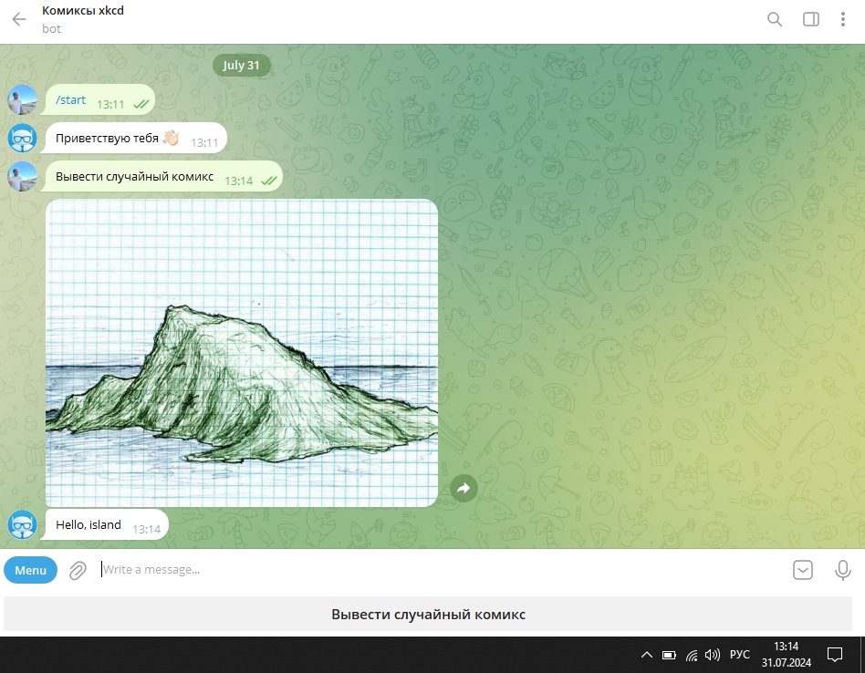

# Скачивает и публикует комиксы в Telegram бот

## Скачивание комиксов с сайта xkcd.com

Скачивает запрашиваемое количество комиксов в папку ``` Comics ```

В терминале вводите команду

```python 
python Comic_Downloader.py ['Количество комиксов']
```


У вас создатся новая директория ``` Comics ```


В данной директории у вас будут находиться изображения комиксов, а так же их коментарии от автора, в текстовом документе ``` Coments ```

## Публикация комиксов в Телеграм боте

Публикует фотографии комикса и коментарий к нему из заданной директории, в Телеграм бот

### Где брать ключи и куда их класть

Для работы данного модуля вам понадобится:
- Токен созданного вами Телеграм бота


Их вы заносите в файл ``` .env ```

### Пример использования

Запускаем скрипт из командной строки, командой:
```python
python Telegram_bot.py
``` 


Переходим в ваш бот и прописываем команду ``` /start ```

У вас появиться одна кнопка, нажимая на неё, у вас будет публиковаться случайный комикс



## Как установить

Python3 должен быть уже установлен. 
Затем используйте `pip` (или `pip3`, если есть конфликт с Python2) для установки зависимостей:
```
pip install -r requirements.txt
```