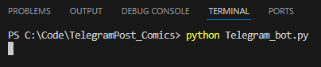

# Скачивает и публикует комиксы в Telegram канал

## Публикация комиксов в Телеграм канал

Публикует фотографии комикса и коментарий к нему из заданной директории, в Телеграм канал

### Где брать ключи и куда их класть

Для работы данного модуля вам понадобится:
- Токен созданного вами Телеграм бота


- Chat id вашего Телеграм канала


Их вы заносите в файл ``` .env ```

### Пример использования

Запускаем скрипт из командной строки, командой:
```python
python Telegram_bot.py
``` 



После успешного выполнения скрипта, в Телеграмм канале появится комикс


## Как установить

Python3 должен быть уже установлен. 
Затем используйте `pip` (или `pip3`, если есть конфликт с Python2) для установки зависимостей:
```
pip install -r requirements.txt
```